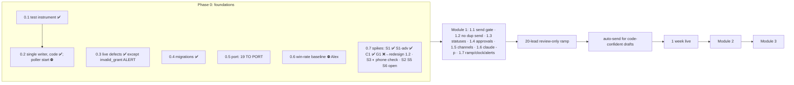

# End-to-end status: lead in → reply out → nothing forgotten → paid

**Reader:** Claude Code, at the start of every session in this repo (HANDOFF's top line and its "Prompt for Next
Session" point here). **Trigger to update:** any checklist row changes state. Update it in the same commit as the
work, never later. **Owner:** whichever session changes the row.
**Last verified against sources:** 2026-10-09 (`f789b53`..`67360be`), by the price-block session.

> **Trust rule.** This file is a map, not evidence. Every status row names its SOURCE and a VERIFY command or
> location. Before acting on a row, or quoting it to Alex as fact, re-check it at the source. If the source
> disagrees, fix THIS file and say so. On 2026-10-09 three trackers were stale at once: HANDOFF said "29 TO PORT"
> (source: 19); the `## UNEXECUTED` table in `spikes.md` still listed C1a (PASSED 10-03) and G1 (FAILED 10-03) and
> said the manifest "does not exist yet" (this file's first version trusted it for G1, and G1 was needlessly re-run); project memory said "LIVE on Railway" (stopped 10-03). A summary table is never the
> source.

## The plan (source: `docs/plans/2026-10-02-booking-hub-roadmap.md`, Alex 2026-10-02)

```
 PHASE 0 foundations ──► MODULE 1 lead replies ──► 1 week live ──► MODULE 2 nothing forgotten ──► 1 week live ──► MODULE 3 money
   (in progress)          (plan written,          (0 unresolved      (NOT planned: write the plan       (NOT planned)
                           not started)            ALERT FAILED)       only after M1 runs a week)
```



**Fixed decisions (do not re-derive; source: the roadmap's Decisions table):** host = Alex's MacBook (lid open,
charger, `caffeinate`), not Railway. Drafting = `claude -p` on Claude Max, never an API key. Code decides
"confident"; auto-send only after a 20-lead review-only ramp. GigSalad = email reply (Chrome fallback). Yelp =
approve-only, with AI disclosure. Alerts = iMessage to self, read back (Telegram only if that fails; no Twilio).
Success measures: win rate above the 0.6 baseline at 3 months; ≥80% of GigSalad leads answered within 1 hour;
then 0 off-calendar gigs / 0 missed money or COI dates; then hours back.

## Checklist: Phase 0 (plan: `docs/plans/2026-10-02-feat-hub-phase0-lead-replies-plan.md` §0.1–0.7)

| ☐/☑ | Item | Status (verified 2026-10-09) | Source / verify | Owner · blocker |
|---|---|---|---|---|
| ☑ | 0.1 test instrument (`test:match`) | PASSED 10-03 | `spikes.md` row "0.1 `test:match` instrument" | — |
| ☑ | 0.2 code: single writer, lease | done | HANDOFF header; plan §0.2 | — |
| ☐ | 0.2 step 5: **start the Mac poller** | NOT started (`.env` `DRY_RUN=true`) | `spikes.md` row "0.2 step 4" | **Alex only. HARD GATE: never start it against real mail without his explicit yes** |
| ☐ | 0.3 `invalid_grant` ALERT half | not written (`alert.ts` can't deliver until Module 1) | `spikes.md` row "0.3 `/health` fields" | Claude, inside Module 1.7 |
| ☑ | 0.3 other live defects, 0.4 migrations | done | `spikes.md` 0.3 rows; HANDOFF header | — |
| ☐ | **0.5 port: 19 TO PORT** | R006, R020–R025, R081–R085, R087–R089, R329, R398, R403 (NP1/NP3/NP2 3-4h/NP duo prices still open), R405 | `port-manifest.md`; count with **V1** below | Claude; **any new or changed price needs Alex's numbers** |
| ☐ | **0.6 win-rate baseline** | BLOCKED | HANDOFF ("0.6 baseline is blocked"): GigSalad not signed in; Yelp dashboard refused (client data) | **Alex**: sign in + allow, or read the numbers himself |
| ☑ | S1, S1-adv (locked `claude -p`, injection) | PASSED 10-03 | `spikes.md` `## Executed` | — |
| ☑ | C1 (Railway stopped; C1b waived by Alex) | PASSED 10-03 | `spikes.md` rows C1a, C1b. ⚠ GitHub auto-deploy note there | — |
| ☑ | G1 Gmail supplied Message-ID | **FAIL 10-03** (Gmail replaces it; search verified by controls); repeated 10-09, same result | `spikes.md` G1 result rows (NOT the UNEXECUTED table) | **Consequence: plan §1.2 duplicate-send recovery must be redesigned** (candidates: body/subject token, or the Gmail id from the send response); auto-send stays off until then |
| ☐ | S2 GigSalad email reply lands on platform | not run | `## UNEXECUTED` row S2 | **Alex**, on the next real GigSalad lead |
| ◐ | S3 iMessage to self + read-back | **PASSED machine side 10-09** (sent + delivered, read back from `chat.db`); phone confirmation pending | `spikes.md` row "S3: iMessage to self + read-back \| 2026-10-09" | Alex: confirm it reached the iPhone. Finding: self-messages create two rows; only `is_from_me=1` is Alex |
| ☐ | S5 Gmail token valid on day 8 | not run | row "S5 step 2" | **Claude, on or after 2026-10-11**: the `getProfile` call in that row |
| ☐ | S6 overnight awake + catch-up | not run | row S6 | Alex (a night) |
| ☐ | FileVault restart after an OS update | not run | row FileVault | Alex (next macOS update) |

**V1 (port count by status column; known answer 2026-10-09: 197 ALREADY PRESENT, 156 PORTED, 34 NOT PORTED,
19 TO PORT, 406 total):**

```
awk -F'|' '/^\| R[0-9]+ \|/{s=$5; gsub(/^ +| +$/,"",s); c[s]++} END{for(k in c) print c[k], k}' docs/research/2026-10-02-booking-hub/port-manifest.md
```

## Checklist: Module 1 (plan §1.1–1.7). Not started.

☐ 1.1 send gate (structured quote, one final check) · ☐ 1.2 no automatic duplicate send (`outbound_messages`;
**REDESIGN: G1 failed**) · ☐ 1.3 statuses + single completion path · ☐ 1.4 approvals · ☐ 1.5 channels · ☐ 1.6 `claude -p`
provider (`src/claude-cli.ts`; S1 proved the lockdown) · ☐ 1.7 ramp, clock, alerts (needs S3 or S4) ·
☐ 20-lead review-only ramp · ☐ auto-send on · ☐ 1 week live, 0 unresolved ALERT FAILED.
Gate (port manifest header): Module 1 cannot go live while any manifest row is `UNREVIEWED` or `BLOCKED`
(today: 0 and 0).

## Known risks on the path (found by sessions; each recorded at its source)

| Risk | Where recorded | Status |
|---|---|---|
| Classifier puts the VENUE in `organization_name` (2/2 runs) → an NP2 in-kind line thanks the hotel; no check holds it | `docs/reviews/2026-10-09-price-block-local-runs.md` | separate item, not planned (Alex) |
| `PF_INTEL_API_URL` in local `.env` is Railway-internal → venue lookups fail silently; production unknown (and production is moving to the Mac anyway) | HANDOFF "NEW items" | Alex to check; never edit `.env` without asking |
| Classifier's T2/T3 call decides whether NP2 fires (first real texts: 0/3 priced) | local-runs record | watch in the ramp |
| Real-lead false-hold rate of the price block unmeasured (6 runs, 3 texts) | solution doc `architecture/2026-10-09-app-writes-fixed-lines-model-writes-a-marker.md` | measure in the 20-lead ramp |
| S1-adv: the model appended a meta note under the draft on an injection lead | `spikes.md` row S1-adv | Module 1 post-check must hold text outside the reply |
| Gmail token: if S5 fails, a weekly re-auth reminder is needed | `spikes.md` S5 rows | check on/after 2026-10-11 |

## Critical path (the order sessions should pull from, unless Alex picks otherwise)

1. Things only Alex can unblock, raised every session until done: **0.6 baseline**, **S2** (next GigSalad lead),
   **S3 phone confirmation**, **S6** (a night), the **PF-Intel URL** check.
2. Claude: **S5 on/after 2026-10-11**; then the **19 TO PORT** rows (prices need Alex's numbers).
3. Module 1 plan review → build 1.1–1.7 → redesign 1.2's send-recovery key (G1 failed) → 20-lead ramp → auto-send → 1 week live.
4. Only then: write the Module 2 plan from the live results.

## How to update this file

Change a row in the SAME commit as the work that changed it, with the date and the source. Never mark ☑ without
a source line you checked. If you find this file stale, fix it, and add the stale premise to the trust rule
above.
